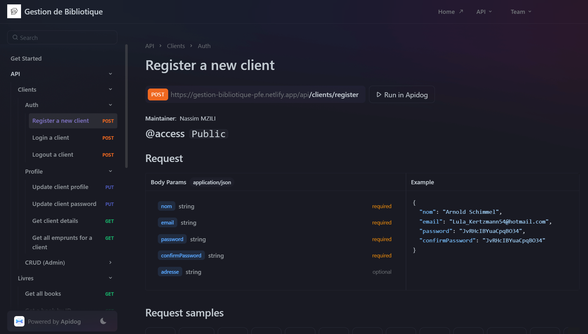
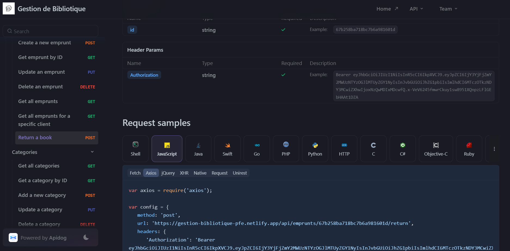

# 📚 Gestion de Bibliothèque - Projet MERN Stack

Un système de gestion de bibliothèque full-stack construit avec la stack **MERN** (MongoDB, Express.js, React, Node.js). Ce projet permet aux utilisateurs de gérer les livres, les clients, les emprunts et les catégories dans une bibliothèque. Il inclut des fonctionnalités d'authentification, de contrôle d'accès basé sur les rôles, et une interface front-end réactive.

---

## Navigation

- [Fonctionnalités](#fonctionnalités)
- [Technologies Utilisées](#technologies-utilisées)
- [Utilisation](#utilisation)
- [Structure du Projet](#structure-du-projet)
- [Documentation de l'API](#documentation-de-lapi)
- [Captures d'Écran](#captures-décran)

## Fonctionnalités

### **Fonctionnalités Client**

- **Authentification** : Inscription, connexion et déconnexion.
- **Gestion du Profil** : Mettre à jour les détails du client (nom, email, adresse).
- **Gestion des Livres** :
  - Parcourir les livres disponibles.
  - Vérifier la disponibilité des livres.
- **Gestion des Emprunts** :
  - Emprunter des livres (créer des emprunts).
  - Retourner des livres.
  - Voir l'historique des emprunts.

### **Fonctionnalités Admin**

- **Gestion des Livres** :
  - Ajouter, mettre à jour et supprimer des livres.
  - Gérer les quantités de livres.
- **Gestion des Catégories** :
  - Ajouter, mettre à jour et supprimer des catégories.
- **Gestion des Clients** :
  - Voir et gérer les comptes clients.
- **Gestion des Emprunts** :
  - Voir tous les emprunts.
  - Mettre à jour le statut des emprunts.

---

## Technologies Utilisées

### **Back-End**

- **Node.js** - Environnement d'exécution JavaScript pour le serveur.
- **Express.js** - Framework web pour construire des API RESTful.
- **MongoDB** - Base de données NoSQL pour stocker les données.
- **Mongoose** - ODM (Object Data Modeling) pour MongoDB.
- **JWT (JSON Web Tokens)** - Authentification et autorisation.

### **Outils**

- **Postman** - Test des API.
- **Git** - Contrôle de version.

---

## Utilisation

### Prérequis

- **Node.js** (v16 ou supérieur)
- **MongoDB** (instance locale ou cloud)
- **Git** (optionnel)

### Installation

> **Cloner le Dépôt**

```bash
git clone https://github.com/mziliNassim/library-management
cd library-management
```

#### Back-End

1. **Installer les Dépendances**

   ```bash
   cd server
   npm install
   ```

2. **Configurer les Variables d'Environnement**

   - Créez un fichier `.env` dans le dossier `server` :

     ```env
     PORT=5000

     # MONGO_URI=your_mongodb_connection_uri
     MONGO_URI=mongodb://localhost:27017/bibliotheque

     JWT_SECRET=your_jwt_secret_key
     ```

3. **Créez un fichier `netlify.toml` dans le dossier `server` :**

   ```toml
   [build]
      functions = "functions"
      publish = "public"

   [[redirects]]
      from = "/\*"
      to = "/.netlify/functions/app"
      status = 200
   ```

4. **Démarrer le Serveur Back-End**

   ```bash
   # init netlify in the project directory
   npm install -g netlify-cli@11.4.0
   netlify init

   # "scripts" : { "dev": "netlify dev" }
   npm run dev
   ```

5. **Accéder à l'Application**

   - Back-End : L'API est accessible sur `http://localhost:8888/`.

#### Front-End

1. **Installer les Dépendances**

   ```bash
   cd client
   npm install
   ```

2. **Configurer les Variables d'Environnement**

   - Créez un fichier `.env` dans le dossier `client` :

   ```env
   VITE_SERVER_URL=your_production_server_url

   VITE_SERVER_URL_DEV=your_development_server_url # http://localhost:8888

   VITE_ENV=dev # dev or prod
   ```

3. **Démarrer le Serveur Back-End**

   ```bash
   npm run dev
   ```

4. **Accéder à l'Application**

   - Front-End sur `http://localhost:5173/`.

---

## Structure du Projet

### Back-End

    server/
    ├── config/ # Configuration de la base de données et autres
    ├── controllers/ # Logique pour gérer les routes
    ├── functions/app.js # Configuration de l'application Express
    ├── middlewares/ # Middlewares d'authentification et autres
    ├── models/ # Modèles MongoDB (Client, Livre, Emprunt, Categorie)
    ├── routes/ # Routes API
    ├── .env # Variables d'environnement
    ├── .gitignore # Fichiers et dossiers à ignorer dans Git
    ├── netlify.toml # Configuration Netlify pour le déploiement
    ├── package-lock.json # Dépendances exactes pour le projet Node.js
    └── package.json # Dépendances et scripts npm

---

## Documentation de l'API

_Visitez la documentation de l'API [ici](https://gestion-bibliotique.apidog.io/), pour plus de détails sur les endpoints et les requêtes._

### **Clients**

#### **_1 - Authentification_**

- > Client Authentification Documentation [ici](https://gestion-bibliotique.apidog.io/register-a-new-client-13650961e0)

- **Inscription** : `POST /api/clients/register`
  **Accès** : Public
  **Description** : Permet à un nouveau client de s'inscrire.

- **Connexion** : `POST /api/clients/login`
  **Accès** : Public
  **Description** : Permet à un client de se connecter.

- **Déconnexion** : `POST /api/clients/logout`
  **Accès** : Client
  **Description** : Permet à un client de se déconnecter.

#### **_2 - Profil_**

- > Client Profile Documentation [ici](https://gestion-bibliotique.apidog.io/update-client-profile-14025249e0)

- **Mettre à Jour le Profil** : `PUT /api/clients/profile`
  **Accès** : Client
  **Description** : Permet à un client de mettre à jour ses informations de profil.

- **Changer le Mot de Passe** : `PUT /api/clients/password`
  **Accès** : Client
  **Description** : Permet à un client de changer son mot de passe.

- **Obtenir les Détails du Client** : `GET /api/clients/me`
  **Accès** : Client
  **Description** : Récupère les détails du client connecté.

- **Obtenir les Emprunts du Client** : `GET /api/clients/emprunts`
  **Accès** : Client
  **Description** : Récupère tous les emprunts du client connecté.

#### **_3 - CRUD_**

- > Clients CRUD Documentation [ici](https://gestion-bibliotique.apidog.io/get-all-clients-14027756e0)

- **Obtenir Tous les Clients** : `GET /api/clients/`
  **Accès** : Admin
  **Description** : Récupère la liste de tous les clients (pour les administrateurs).

- **Obtenir un Client par ID** : `GET /api/clients/:id`
  **Accès** : Admin
  **Description** : Récupère les détails d'un client spécifique par son ID.

- **Mettre à Jour un Client** : `PUT /api/clients/:id`
  **Accès** : Admin
  **Description** : Permet à un administrateur de mettre à jour les informations d'un client.

- **Supprimer un Client** : `DELETE /api/clients/:id`
  **Accès** : Admin
  **Description** : Permet à un administrateur de supprimer un client.

---

### **Livres**

- > Livres Documentation [ici](https://gestion-bibliotique.apidog.io/get-all-books-14029046e0)

- **Obtenir Tous les Livres** : `GET /api/livres`
  **Accès** : Public
  **Description** : Récupère la liste de tous les livres disponibles.

- **Obtenir un Livre par ID** : `GET /api/livres/:id`
  **Accès** : Public
  **Description** : Récupère les détails d'un livre spécifique par son ID.

- **Ajouter un Livre** : `POST /api/livres`
  **Accès** : Admin uniquement
  **Description** : Permet à un administrateur d'ajouter un nouveau livre.

- **Mettre à Jour un Livre** : `PUT /api/livres/:id`
  **Accès** : Admin uniquement
  **Description** : Permet à un administrateur de mettre à jour les informations d'un livre existant.

- **Supprimer un Livre** : `DELETE /api/livres/:id`
  **Accès** : Admin uniquement
  **Description** : Permet à un administrateur de supprimer un livre.

---

### **Emprunts**

- > Emprunts Documentation [ici](https://gestion-bibliotique.apidog.io/create-a-new-emprunt-14057301e0)

- **Créer un Emprunt** : `POST /api/emprunts`
  **Accès** : Client uniquement
  **Description** : Permet à un client de créer un nouvel emprunt (emprunter un livre).

- **Obtenir un Emprunt par ID** : `GET /api/emprunts/:id`
  **Accès** : Client ou Admin
  **Description** : Récupère les détails d'un emprunt spécifique par son ID.

- **Mettre à Jour un Emprunt** : `PUT /api/emprunts/:id`
  **Accès** : Admin uniquement
  **Description** : Permet à un administrateur de mettre à jour les informations d'un emprunt (par exemple, prolonger la date de retour).

- **Supprimer un Emprunt** : `DELETE /api/emprunts/:id`
  **Accès** : Admin uniquement
  **Description** : Permet à un administrateur de supprimer un emprunt.

- **Obtenir Tous les Emprunts** : `GET /api/emprunts`
  **Accès** : Admin uniquement
  **Description** : Récupère la liste de tous les emprunts (pour les administrateurs).

- **Obtenir les Emprunts d'un Client** : `GET /api/emprunts/client/:clientId`
  **Accès** : Client ou Admin
  **Description** : Récupère tous les emprunts d'un client spécifique. Un client ne peut accéder qu'à ses propres emprunts, tandis qu'un administrateur peut accéder à tous les emprunts.

- **Retourner un Livre** : `POST /api/emprunts/:id/return`
  **Accès** : Client ou Admin
  **Description** : Permet de marquer un emprunt comme retourné (rendre un livre).

---

### **Catégories**

- > Catégories Documentation [ici](https://gestion-bibliotique.apidog.io/get-all-categories-14128320e0)

- **Obtenir Toutes les Catégories** : `GET /api/categories`
  **Accès** : Public
  **Description** : Récupère la liste de toutes les catégories disponibles.

- **Obtenir une Catégorie par ID** : `GET /api/categories/:id`
  **Accès** : Public
  **Description** : Récupère les détails d'une catégorie spécifique par son ID.

- **Ajouter une Catégorie** : `POST /api/categories`
  **Accès** : Admin uniquement
  **Description** : Permet à un administrateur d'ajouter une nouvelle catégorie.

- **Mettre à Jour une Catégorie** : `PUT /api/categories/:id`
  **Accès** : Admin uniquement
  **Description** : Permet à un administrateur de mettre à jour les informations d'une catégorie existante.

- **Supprimer une Catégorie** : `DELETE /api/categories/:id`
  **Accès** : Admin uniquement
  **Description** : Permet à un administrateur de supprimer une catégorie.

---

## Captures d'Écran



---



```

```
